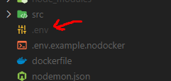
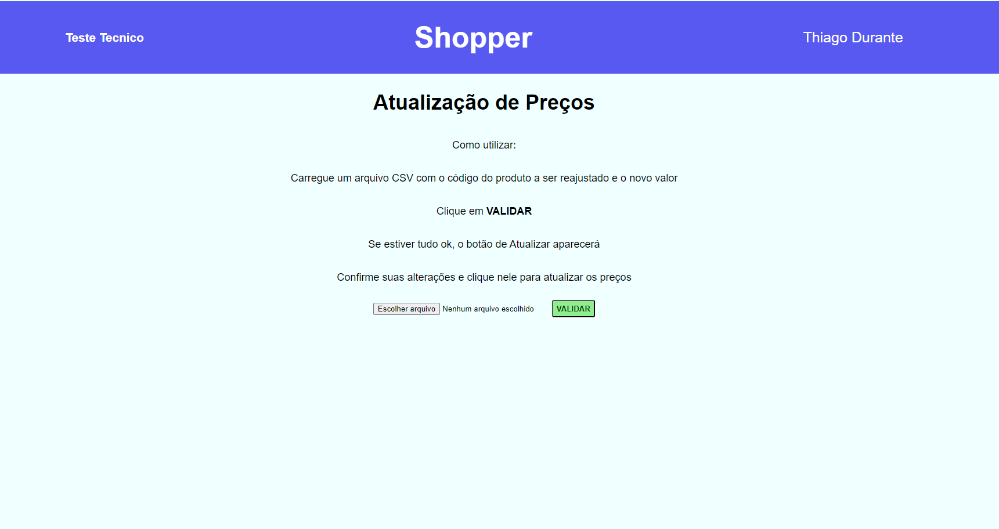
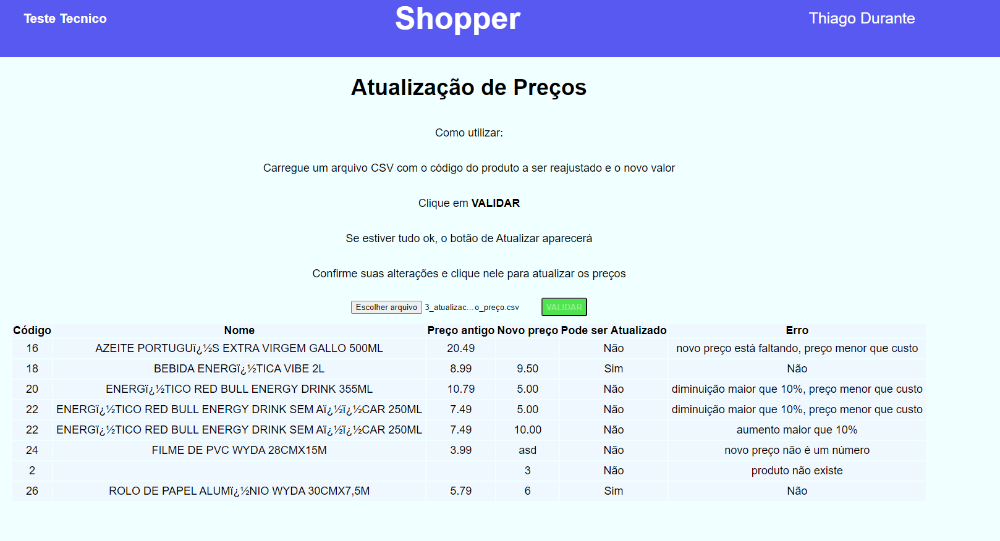
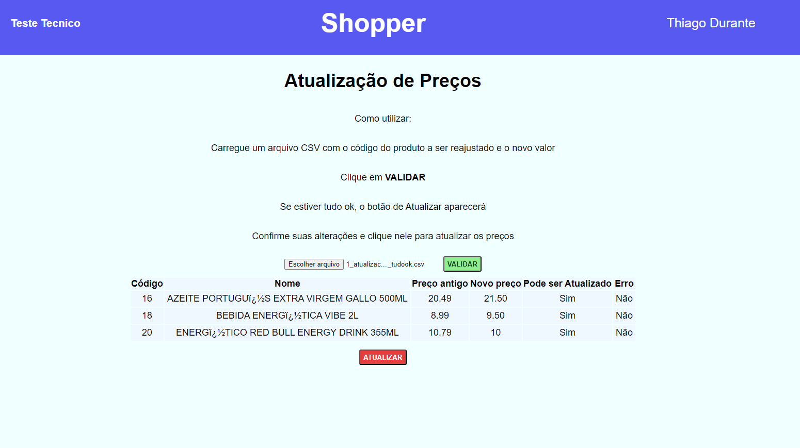

# tt_Shopper

Este foi um projeto full-stack para o teste técnico da Shopper.

O objetivo era construir uma aplicação para atualização de preços de uma empresa, onde deveriamos seguir algumas regras específicas.

O projeto conta com um backend em node/express, um front em ReactJS e um database MySql.
Testes foram feitos com Cypress no front end.

## Instalação

Temos duas maneiras para utilizar o projeto

1. Usando [Docker](https://www.docker.com/) (forma esperada de utilização)
<details>

Após clonar o repositório não esqueça de:

Dentro da pasta app, troque o nome do arquivo .env.example para .env
  


```bash
  # clone o repositório
  # entre na pasta app
  cd tt_shopper/app
  # rode o script de Instalação de dependencias
  npm run install:app
  # caso tenha problemas de permissão neste passo use:
  chmod +x app_install.sh
  # repita o npm run
  # Após isso rode o comando
  docker compose up
```

Depois é só esperar o tempo de build (pode demorar um pouco dependendo do computador/internet)

O front end estará rodando em localhost:3000 (broswer)

A API em localhost:3001 (postman ou simular)

O banco de dado em localhost:3306 (workbench)

</details>
2. Sem Docker
<details>

Aqui você terá que ter o mysql instalado no seu computador
Para o banco de dados sugiro usar workbench para popular o banco com o script provido pela shopper (database.sql) disponível em /appgit add

Após clonar o repositório não esqueça de:

Dentro da pasta app/backend, troque o nome do arquivo .envnodocker.example para .env
  


```bash
  # clone o repositório
  # entre na pasta app
  cd tt_shopper/app
  # rode o script de Instalação de dependencias
  npm run install:app
  # caso tenha problemas de permissão neste passo use:
  chmod +x app_install.sh
  # repita o npm run
  # abra dois terminais novos
  # um deve estar dentro de /app/fronend e rode o comando
  npm start
  # o outro deve estar dentro de /app/backend e rode o comando
  npm start
```

Depois é só esperar o tempo de build (pode demorar um pouco dependendo do computador/internet)

O front end estará rodando em localhost:3000 (broswer)

A API em localhost:3001 (postman ou simular)

O banco de dado em localhost:3306 (workbench)

</details>

## Screenshots

<details>





</details>

## Stacks Utilizadas

<details>
Front-end: ReactJS, Cypress, Typescript
Back-end: Node, Express, Sequelize, Typescript
</details>

## Sobre Mim

Sou um desenvolvedor Full-Stack, trabalho com a stack de node/react e estou sempre procurando coisas novas para aprender :)

## Autor

- [@ThiDurante](https://www.github.com/ThiDurante)
- [Linkedin](https://www.linkedin.com/in/thidurante/)

## Agradecimentos
